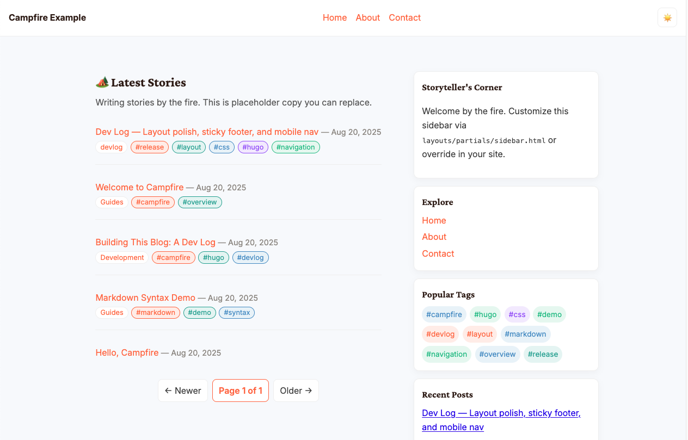

<div align="center">

# 🏕️ Campfire — A Warm, Story‑Focused Hugo Theme



Readable typography, a wider content column, and a practical sidebar. Includes a responsive header with a mobile hamburger, a theme toggle (☀️/🌙) with localStorage persistence, functional sidebar modules, and an enhanced footer with social and license info.

<br/>
<a href="https://campfire-hugo.netlify.app" target="_blank" rel="noopener">Live Demo</a> ·
<a href="#getting-started">Getting Started</a> ·
<a href="#project-structure">Project Structure</a> ·
<a href="#best-practices-guide">Best Practices</a> ·
<a href="#contributing">Contributing</a> ·
<a href="#resources">Resources</a>

</div>

## About The Project

Campfire is a clean, story‑focused Hugo theme designed for blogs, journals, and writing‑first sites. It features comfortable reading, a pragmatic sidebar, dark/light themes with persistence, and a mobile‑friendly header. The example site demonstrates best practices for content structure and metadata.

- Live Demo: https://campfire-hugo.netlify.app
- Built with Hugo Extended, no JavaScript build step required.

## Table of Contents

- [🏕️ Campfire — A Warm, Story‑Focused Hugo Theme](#️-campfire--a-warm-storyfocused-hugo-theme)
  - [About The Project](#about-the-project)
  - [Table of Contents](#table-of-contents)
  - [Getting Started](#getting-started)
    - [Prerequisites](#prerequisites)
    - [Run locally](#run-locally)
    - [Create a new post](#create-a-new-post)
    - [Build a production site](#build-a-production-site)
  - [Project Structure](#project-structure)
  - [Best Practices Guide](#best-practices-guide)
    - [Git \& GitHub](#git--github)
    - [Documentation](#documentation)
    - [Open Source \& Community](#open-source--community)
    - [Code Hygiene](#code-hygiene)
    - [CI/CD \& Deployment](#cicd--deployment)
  - [Contributing](#contributing)
  - [License](#license)
  - [Resources](#resources)

<!-- GETTING STARTED -->

## Getting Started

Run the included example site using the Campfire theme.

### Prerequisites
* Install Hugo Extended: https://gohugo.io/installation/

### Run locally
```bash
# From repository root, start the example site
hugo server -D --source exampleSite
```

Open http://localhost:1313 to view the site. The config sets `baseURL = "https://campfire-hugo.netlify.app/"`, `title = "Campfire Example"`, `theme = "Campfire"`, and `themesDir = "../"` so Hugo loads the theme from this repo.

### Create a new post
```bash
hugo new content/posts/my-first-story.md --source exampleSite
```

### Build a production site
```bash
hugo --minify --source exampleSite --destination public
```


## Project Structure

This template provides a foundational directory structure. You will adapt and expand upon this based on your specific project needs.

```
.github/
├── ISSUE_TEMPLATE/
│   ├── bug_report.md
│   └── feature_request.md
├── PULL_REQUEST_TEMPLATE.md
└── workflows/
    └── ci-cd.yml
CONTRIBUTING.md
CODE_OF_CONDUCT.md
SECURITY.md
LICENSE
README.md
package.json
# Your project-specific files and folders go here
```

## Best Practices Guide

This section outlines key best practices for building robust and maintainable open-source JAMstack projects. For detailed guidance on each topic, refer to the linked resources.

### Git & GitHub

*   **Branching Strategy:** Adopt a consistent branching strategy (e.g., Git Flow, GitHub Flow) to manage development, features, and releases effectively. [Learn more about Git branching strategies](https://www.atlassian.com/git/tutorials/comparing-workflows).
*   **Atomic Commits:** Make small, focused commits with clear, descriptive messages. [Read about writing good commit messages](https://www.conventionalcommits.org/en/v1.0.0/).
*   **Pull Requests (PRs):** Use PRs for code review and collaboration. Ensure they are well-described and link to relevant issues. [GitHub's guide to creating a pull request](https://docs.github.com/en/pull-requests/collaborating-with-pull-requests/proposing-changes-with-pull-requests/creating-a-pull-request).

### Documentation

*   **Comprehensive README:** This `README.md` serves as your project's entry point. Keep it updated and informative.
*   **In-code Documentation:** Use comments and docstrings to explain complex logic within your code.
*   **External Documentation:** For extensive documentation (e.g., API references, detailed guides), consider a dedicated documentation site. [Explore tools like Docusaurus](https://docusaurus.io/) or [GitBook](https://www.gitbook.com/).
*   **Boilerplate Docs:** For standard documents like Code of Conduct, Security Policy, and Issue/PR templates, it's often best to link to well-established resources or use GitHub's built-in features.
    *   [**Code of Conduct:** Contributor Covenant](https://www.contributor-covenant.org/)
    *   [**Security Policy:** GitHub Security Policy](https://docs.github.com/en/code-security/getting-started/adding-a-security-policy-to-your-repository)
    *   [**Issue Templates:** GitHub Issue Templates](https://docs.github.com/en/communities/using-templates-to-encourage-useful-issues-and-pull-requests/configuring-issue-templates-for-your-repository)
    *   [**Pull Request Templates:** GitHub Pull Request Templates](https://docs.github.com/en/communities/using-templates-to-encourage-useful-issues-and-pull-requests/creating-a-pull-request-template-for-your-repository)

### Open Source & Community

*   **Licensing:** Choose an appropriate open-source license for your project. [Choose a License](https://choosealicense.com/) can help.
*   **Contribution Guidelines:** Provide clear guidelines for contributors. [Example CONTRIBUTING.md](https://docs.github.com/en/communities/setting-up-your-project-for-healthy-contributions/setting-guidelines-for-contributing-to-your-project).
*   **Community Engagement:** Actively engage with your community by responding to issues, PRs, and discussions. Foster a welcoming environment.
*   **Promoting Your Project:** Once your project is ready, consider sharing it on relevant platforms:
    *   **Hugo Themes Website:** If it's a Hugo theme, submit it to the [official Hugo Themes website](https://themes.gohugo.io/).
    *   **JAMstack Themes:** List your theme on [JAMstack Themes](https://jamstackthemes.dev/).
    *   **Social Media & Forums:** Share your work on Twitter, Reddit (e.g., r/gohugo, r/jamstack), and other developer communities.
    *   **Blogging:** Write a blog post about your theme, its features, and how to use it.

### Code Hygiene

*   **Linting & Formatting:** Use tools like ESLint, Prettier, or Black to enforce consistent code style and catch errors early.
*   **Automated Testing:** Implement unit, integration, and end-to-end tests to ensure code quality and prevent regressions.
*   **Dependency Management:** Clearly define and manage project dependencies.

### CI/CD & Deployment

*   **Automated Workflows:** Set up Continuous Integration (CI) and Continuous Deployment (CD) pipelines (e.g., GitHub Actions, Netlify, Vercel) to automate building, testing, and deploying your project.
*   **Environment Variables:** Securely manage sensitive data using environment variables.
*   **CDN Usage:** Deploy static assets to a Content Delivery Network (CDN) for optimal performance.

<!-- CONTRIBUTING -->

## Contributing

We welcome contributions! Please see our [CONTRIBUTING.md](CONTRIBUTING.md) for details on how to get started.

<!-- LICENSE -->

## License

This project is licensed under the [MIT License](LICENSE).

<!-- RESOURCES -->

## Resources

This section will contain a curated list of valuable resources for JAMstack development, specific frameworks, and open-source best practices.

*   [JAMstack.org](https://jamstack.org/) - The official JAMstack website.
*   [Hugo Documentation](https://gohugo.io/documentation/) - Official documentation for Hugo.
*   [Jekyll Documentation](https://jekyllrb.com/docs/) - Official documentation for Jekyll.
*   [11ty Documentation](https://www.11ty.dev/docs/) - Official documentation for 11ty.
*   [Gatsby Documentation](https://www.gatsbyjs.com/docs/) - Official documentation for Gatsby.

